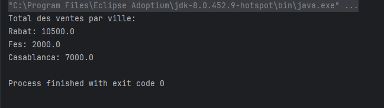
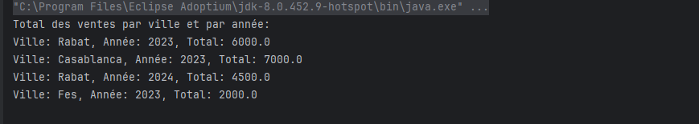

# TP3 - Traitement de données avec Apache Spark (RDD)

## 📚 Objectif

Ce TP a pour but de manipuler Apache Spark en Java pour effectuer des traitements sur un fichier texte (`ventes.txt`) contenant des données de ventes. Le but est de calculer :

1. **Le total des ventes par ville**
2. **Le total des ventes par ville et par année**

---

## 🧾 Structure du fichier `ventes.txt`

Chaque ligne représente une vente et a le format suivant :

##### date ville produit prix

## 🛠️ Prérequis

- Java 8 (OpenJDK 1.8+)
- Maven
- IntelliJ IDEA (ou tout autre IDE)
- Spark 3.x (utilisé via Maven)

---

## ✅ Résultats attendus
Pour l’exercice 1 :

Pour l’exercice 2 :

## 👨‍💻 Auteur
Nom : Leknouch Wissal

Formation : BDCC - ENSET Mohammedia
